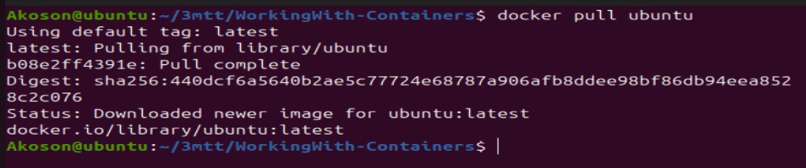
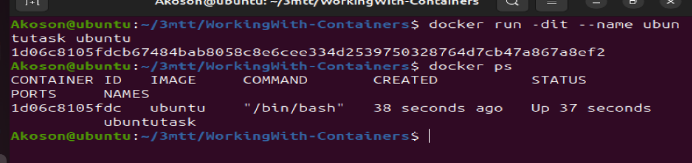
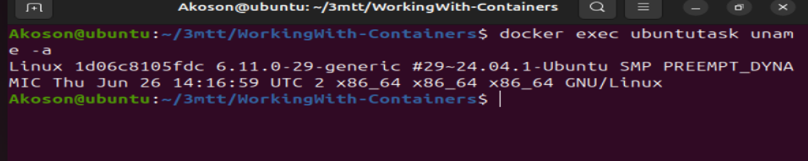
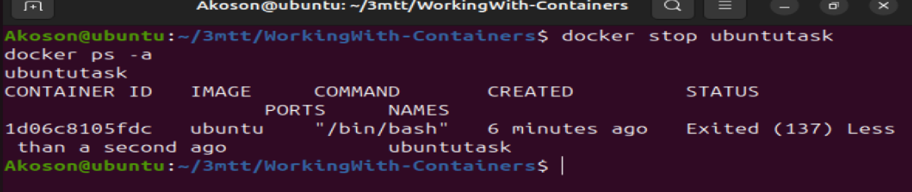
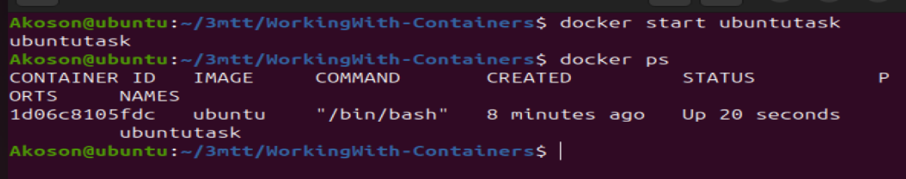
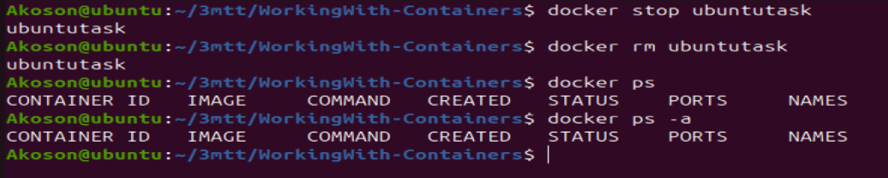

# Working with Container

## Side Hustle Task: Docker Container Operations

### Start a Container and Run a Simple Command:

### 1. Use an official Ubuntu image to start a container. If you don't have the image, you can pull it from docker hub

### 2. Run a simple command within the container, such as displaying the system information.

### 3. Stop the Container and Verify Its Status:

### 4. Stop the running container

### 5. Verify that the container is stopped

### 6. Note the status column to confirm the container's status.

### 7. Restart the Container and Observe Changes:

### 8. Restart the stopped container

### 9. Verify the container's status again to ensure it's running

### 10 Observe any changes or differences in the container's behavior after the restart.

### 11. Remove the Container:

### 12 Stop the running container (if it's still running)

### 13 Remove the container

### 14 Verify that the container is removed

### 15 Confirm that the container is no longer listed.

## Project Implementation

### Running container

### Running container in stay alive mode and verifying container is running

### This will show the system information while keeping the container alive.

### Stopping container and verifying it stopped

### Starting container and confirming container was started

### Stopping running container, removing stopped container and verifying container was does not exist.

